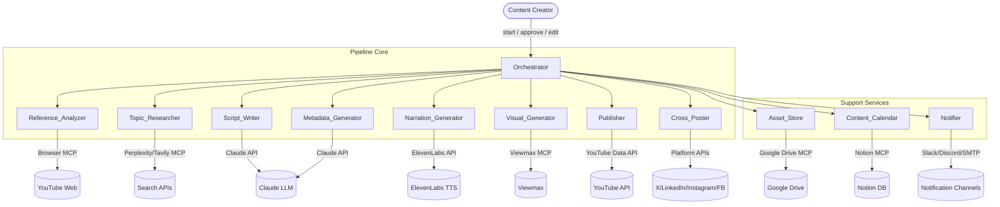
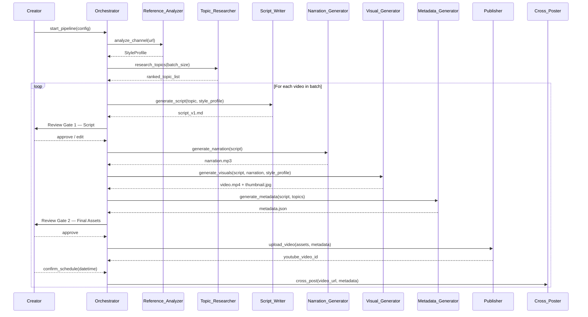
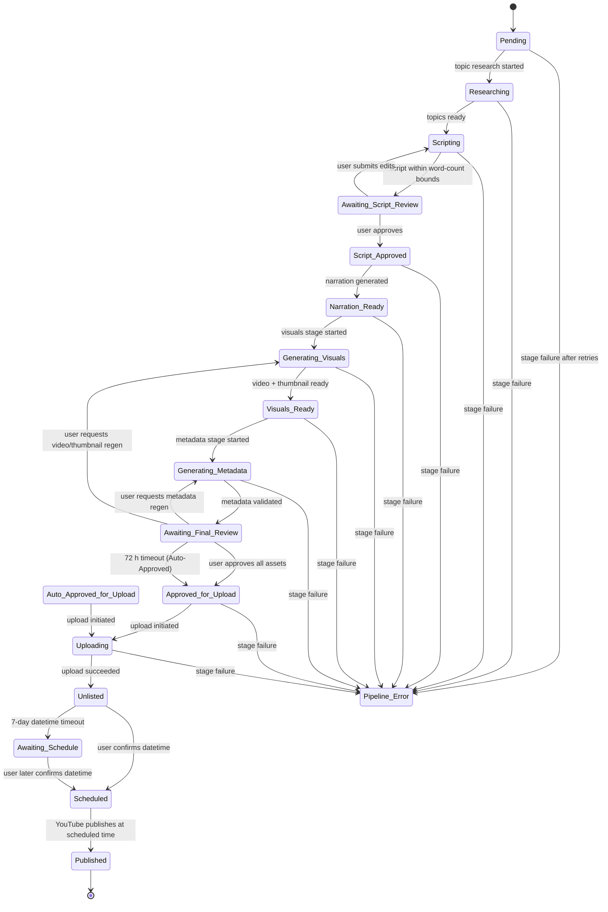

# Design Document: AI YouTube Content Pipeline

## Overview

The AI YouTube Content Pipeline is an end-to-end automated system that takes a creator from zero
to a scheduled YouTube video — and optionally cross-posted across social platforms — with minimal
manual effort. The only human touchpoints are two explicit Review Gates (script review and
final-asset review) and the final scheduling confirmation.

The Orchestrator is a Claude-based agent that drives the pipeline by sequencing tool calls to
twelve subsystems. Each subsystem wraps one or more external MCP servers or APIs behind a
well-defined interface, and every handoff is recorded in a Notion Content Calendar and all
artifacts are persisted to Google Drive.

### Key Design Goals

- **Idempotent stages** — every stage can be retried safely; completed outputs are preserved.
- **Human-in-the-loop** — two mandatory Review Gates prevent publishing without creator sign-off.
- **Observable** — every API call, status transition, and retry is written to a structured JSON log.
- **Configurable** — voice ID, notification channels, cross-posting toggles, and batch size are
  all runtime configuration; no code changes are needed to switch providers.

---

## Architecture

### High-Level Component Diagram



### Execution Flow



---

## Pipeline State Machine

Each video record in the Content Calendar progresses through the following 18 states.
Transitions are driven exclusively by the Orchestrator.



### Status Values (18 total)

| Status | Description |
|---|---|
| `Pending` | Video slot created; no stages started |
| `Researching` | Topic_Researcher is executing |
| `Scripting` | Script_Writer is generating or revising script |
| `Awaiting Script Review` | Review Gate 1 is open |
| `Script Approved` | Creator approved script; narration stage next |
| `Narration Ready` | MP3 generated and stored |
| `Generating Visuals` | Viewmax MCP clips being compiled |
| `Visuals Ready` | MP4 and thumbnail JPEG stored |
| `Generating Metadata` | Metadata_Generator running |
| `Awaiting Final Review` | Review Gate 2 is open |
| `Approved for Upload` | Creator approved; upload stage next |
| `Auto-Approved for Upload` | 72-hour timeout auto-approved |
| `Uploading` | YouTube Data API upload in progress |
| `Unlisted` | Upload succeeded; awaiting schedule confirmation |
| `Awaiting Schedule` | 7-day datetime window expired; video stays unlisted |
| `Scheduled` | Publish datetime confirmed and set in YouTube API |
| `Published` | Video is public on YouTube |
| `Pipeline Error — {stage_name}` | Stage failed after all retries exhausted |

---

## Components and Interfaces


### 1. Orchestrator

The Orchestrator is a Claude-based agent loop that reads the pipeline configuration, resolves which
stage to execute next for each video record, calls the appropriate subsystem, handles errors
returned by subsystems, and writes status transitions back to the Content Calendar.

**Interface**

```python
class Orchestrator:
    def start_pipeline(config: PipelineConfig) -> PipelineRun
    def resume_pipeline(run_id: str, video_id: str) -> PipelineRun
    def handle_review_response(video_id: str, gate: Literal["script","final"],
                               action: Literal["approve","edit","regenerate"],
                               payload: Optional[str]) -> None
    def schedule_video(video_id: str, publish_datetime: datetime) -> None
```

**Responsibilities**
- Sequences subsystem calls in the correct order.
- Applies exponential back-off retry logic for transient HTTP errors (429, 500–504).
- Immediately fails on non-transient errors (400, 401, 403, 404).
- Updates Content Calendar status within 30 seconds of every state transition.
- Emits a structured JSON log entry for every API call and state transition.
- Manages batch sequencing (one video at a time).

**Retry Policy (General)**

| Error class | Action |
|---|---|
| 429, 500, 502, 503, 504 | Retry: 5 s → 10 s → 20 s (max 3 attempts) |
| 400, 401, 403, 404 | Immediate failure, no retry |

---

### 2. Reference_Analyzer

Uses Browser MCP to navigate the reference channel, extract metadata, and build the Style_Profile.

**Interface**

```python
class Reference_Analyzer:
    def analyze(channel_url: str) -> StyleProfile
```

**Inputs**
- `channel_url` — validated YouTube channel URL.

**Outputs**
- `StyleProfile` — versioned JSON written to `Asset_Store/style-profiles/`.

**Processing Steps**
1. Navigate to channel URL via Browser MCP.
2. Collect all uploads within the last 90 days; if fewer than 10, use all available (minimum 1).
3. For each upload: extract transcript (narration tone, WPM, sentence length), segment annotations
   (intro/hook/body/CTA), and thumbnail image metadata (dominant colors, text overlay position,
   subject framing).
4. Aggregate into a `StyleProfile` document.
5. Write to Asset_Store; on write failure retry 3× at 10 s intervals.
6. Update Content_Calendar batch record with Style_Profile document ID.

**Error Handling**
- Channel URL inaccessible → log error, notify Notifier, halt pipeline (no JSON written).
- Asset_Store write failure after 3 retries → notify Notifier, halt pipeline.
- Fewer than 10 qualifying uploads → log warning, proceed with available uploads.

**Retry Policy**

| Operation | Attempts | Back-off |
|---|---|---|
| Browser MCP page load | 3 | 5 s → 10 s → 20 s |
| Asset_Store write | 3 | 10 s fixed |

---

### 3. Topic_Researcher

Queries Perplexity or Tavily MCP for trending AI topics and produces a ranked list.

**Interface**

```python
class Topic_Researcher:
    def research(batch_size: int, excluded_titles: list[str]) -> list[TopicEntry]
```

**Inputs**
- `batch_size` — number of topics to return (1 for single-video, 2–50 for batch).
- `excluded_titles` — case-insensitive list of topic titles used in the past 30 days.

**Outputs**
- `list[TopicEntry]` — minimum 5 entries (≥ `batch_size`) sorted by `composite_score` descending.
- JSON document written to `Asset_Store/research/` timestamped to the nearest minute.

**Scoring Algorithm**
Each topic receives a composite score computed as:

```
composite_score = (norm_search_volume + norm_recency + norm_relevance) / 3
```

Where each dimension is normalized via min-max normalization across all candidates in the result
set. Relevance is 1.0 if the topic matches at least one of the subject tags
(`machine learning`, `large language model`, `neural network`, `AI safety`, `generative AI`),
otherwise 0.0.

**Error Handling**
- Partial results (1–4 topics) before exhausting retries → halt, log partial count, do not store.
- Zero results after 3 retries at 30 s intervals → notify Notifier with run ID and failure reason,
  halt pipeline.
- Duplicate topic title (case-insensitive match against past-30-day calendar) → skip, request
  replacement.

**Retry Policy**

| Operation | Attempts | Back-off |
|---|---|---|
| Perplexity/Tavily query | 3 | 30 s fixed |

---

### 4. Script_Writer

Generates a structured script using Claude with Style_Profile injection.

**Interface**

```python
class Script_Writer:
    def generate(topic: TopicEntry, style_profile: StyleProfile,
                 video_id: str) -> Script
    def revise(script: Script, edits: str, video_id: str) -> Script
```

**Inputs**
- `topic` — selected `TopicEntry`.
- `style_profile` — loaded `StyleProfile` document.
- `video_id` — used for versioned filename.

**Outputs**
- `Script` — Markdown file `scripts/script_v{n}.md` in Asset_Store.

**Word Count Enforcement**
1. Generate draft.
2. Count words; if outside 800–1,500 range, revise once automatically.
3. If still outside range after revision, halt stage, set status to
   `Pipeline Error — script_generation`, notify Notifier.

**Annotation Requirements**
- Minimum 1 speaker-direction annotation (`[pause]`, `[emphasis]`, etc.) per segment.
- Annotations aligned with Style_Profile pacing data.

**Versioning**
- First generation: `script_v1.md`.
- Each user-submitted edit: `script_v{n+1}.md` (previous version preserved).

**Error Handling**
- Empty Style_Profile or missing topic → reject, do not generate, notify Notifier.
- Claude API error → apply general retry policy (§1).

---

### 5. Narration_Generator

Calls the ElevenLabs API to synthesize speech from the approved script.

**Interface**

```python
class Narration_Generator:
    def generate(script: Script, voice_id: str, video_id: str) -> NarrationAsset
```

**Inputs**
- `script` — approved `Script` (text ≤ 5,000 characters per API segment).
- `voice_id` — configured ElevenLabs voice ID (must be non-empty).
- `video_id` — used for versioned filename.

**Outputs**
- `NarrationAsset` — MP3 at 44,100 Hz / ≥ 128 kbps, stored as
  `narration/{video_id}_v{n}.mp3` in Asset_Store.

**Pre-flight Check**
- If `voice_id` is absent or empty → notify Notifier, halt before any API call.

**Error Handling**
- ElevenLabs API error → retry 3× with exponential back-off: 5 s → 10 s → 60 s (capped).
- All retries exhausted → discard audio, notify Notifier, halt narration stage.
- Asset_Store write failure → discard audio, notify Notifier, halt narration stage.

**Retry Policy**

| Operation | Attempts | Back-off (start / max) |
|---|---|---|
| ElevenLabs TTS | 3 | 5 s / 60 s exponential |
| Asset_Store write | 3 | 10 s / 80 s exponential |

---

### 6. Visual_Generator

Uses Viewmax MCP to generate per-segment video clips and a thumbnail, then compiles the final MP4.

**Interface**

```python
class Visual_Generator:
    def generate(script: Script, narration: NarrationAsset,
                 style_profile: StyleProfile, video_id: str) -> VisualAsset
```

**Inputs**
- `script` — approved `Script` (segment list used to derive scene prompts).
- `narration` — `NarrationAsset` MP3 path.
- `style_profile` — `StyleProfile` thumbnail composition data.
- `video_id` — used for versioned filenames.

**Outputs**
- `VisualAsset`:
  - `mp4_path` — `videos/{video_id}_v{n}.mp4` (1920×1080, H.264, ≥ 24 fps).
  - `thumbnail_path` — `thumbnails/{video_id}_v{n}.jpg` (1280×720, < 2 MB).

**Scene Prompt Derivation**
- One scene prompt is derived per script segment (body segments + hook + CTA).
- Each prompt incorporates Style_Profile visual composition patterns.
- Output clips are guaranteed not to be pixel-for-pixel reproductions of reference channel frames.

**Audio Sync**
- Compiled MP4 audio offset from narration track must be within ±100 ms.

**Fallback on Clip Failure**
- Per clip: retry 3× with delay sampled from [5, 30] seconds.
- If all retries fail: substitute a static JPEG (1920×1080 fallback image) and log substitution.

**Retry Policy**

| Operation | Attempts | Back-off |
|---|---|---|
| Viewmax MCP clip | 3 | 5–30 s random |
| Asset_Store write | 3 | 10 s / 80 s exponential |

---

### 7. Metadata_Generator

Uses Claude to produce SEO-optimized YouTube metadata from the script and topic data.

**Interface**

```python
class Metadata_Generator:
    def generate(script: Script, topics: list[TopicEntry],
                 video_id: str) -> MetadataPackage
```

**Inputs**
- `script` — approved `Script`.
- `topics` — ranked topic list from Topic_Researcher.
- `video_id` — used for output filename.

**Outputs**
- `MetadataPackage` — JSON document `metadata/{video_id}.json` in Asset_Store containing:
  - `title` — ≤ 60 characters, includes primary keyword.
  - `description` — 200–500 words; one-paragraph summary, chapter markers, 3–5 CTAs/links,
    closing paragraph with ≥ 3 tags from tag list.
  - `tags` — list of 10–15 tags, each 2–5 words.
  - `hashtags` — 3–5 hashtags prefixed `#`, 2–30 characters excluding `#`, no spaces.

**Validation and Regeneration**
- After generation, each field is validated independently.
- One field failing validation → regenerate that field once.
- Field still invalid after one regeneration → halt stage, notify Notifier.

**Error Handling**
- Missing script or topic data → do not attempt generation, notify Notifier.
- Claude API error → apply general retry policy (§1).

---

### 8. Publisher

Manages YouTube upload, privacy state transitions, and scheduling.

**Interface**

```python
class Publisher:
    def upload(video_id: str, assets: VisualAsset,
               metadata: MetadataPackage) -> YouTubeVideoRef
    def schedule(youtube_video_id: str,
                 publish_datetime: datetime) -> None
    def reschedule(youtube_video_id: str,
                   new_datetime: datetime) -> None
```

**Inputs**
- `assets` — MP4 path, thumbnail path.
- `metadata` — `MetadataPackage`.
- `publish_datetime` — UTC datetime, must be > now + 15 minutes.

**Outputs**
- `YouTubeVideoRef` — `{ youtube_video_id, unlisted_url }`.

**Upload Flow**
1. Upload MP4 + thumbnail + metadata via YouTube Data API; set privacy to `Unlisted`.
2. Make `youtube_video_id` and `unlisted_url` available to Notifier within 10 minutes.
3. Send user unlisted URL, prompt for schedule confirmation.
4. Validate confirmed datetime (not in past, not within 15 minutes of now).
5. If invalid → reject, re-prompt.
6. On valid datetime → call YouTube API `videos.update` with `publishAt`.

**Content Calendar Rollback**
- If Content Calendar update fails after 3 retries post-publish → revert YouTube video to
  `Unlisted`, notify Notifier with rollback details.

**Timeout Behaviour**
- No schedule confirmation within 7 days → set status to `Awaiting Schedule`, leave video Unlisted.

**Retry Policy**

| Operation | Attempts | Back-off (start / max) |
|---|---|---|
| YouTube Data API upload | 3 | 60 s / 300 s exponential |
| YouTube Data API schedule | 3 | 5 s / 20 s exponential |
| Content Calendar update | 3 | 5 s / 20 s exponential |

---

### 9. Cross_Poster

Distributes the published video to configured social platforms.

**Interface**

```python
class Cross_Poster:
    def post(video_url: str, metadata: MetadataPackage,
             platforms: list[Platform]) -> list[PostResult]
```

**Caption Generation**
Platform-native captions are derived from title + description + tags. Character budgets:

| Platform | Max characters |
|---|---|
| X | 280 |
| LinkedIn | 3,000 |
| Instagram | 2,200 |
| Facebook | 500 |

Each post includes the YouTube video URL and ≥ 3 hashtags within the character limit.

**Error Handling**
- Per-platform failure → retry 2× at 60 s intervals, then log and notify Notifier with platform
  name and failure reason.
- Failure on one platform → continue posting to remaining enabled platforms.
- Disabled platform → skip silently.

**Trigger**
- Must execute within 30 minutes of video transitioning to `Published`.

---

### 10. Asset_Store

Wraps the Google Drive MCP to provide a structured file system for pipeline artifacts.

**Interface**

```python
class Asset_Store:
    def write(video_id: str, subfolder: SubFolder,
              filename: str, content: bytes) -> DriveURL
    def read(video_id: str, subfolder: SubFolder,
             filename: str) -> bytes
    def url(video_id: str, subfolder: SubFolder,
            filename: str) -> DriveURL
```

**Folder Hierarchy**

```
ai-youtube-pipeline/
└── {video_id}/
    ├── scripts/
    ├── narration/
    ├── videos/
    ├── thumbnails/
    ├── metadata/
    ├── research/
    └── logs/
```

`video_id` is a pipeline-assigned identifier of 1–128 alphanumeric characters, hyphens, or
underscores.

**Constraints**
- `write` must return a Google Drive URL within 10 seconds.
- All files retained for ≥ 90 days from pipeline run date.
- No early deletion.

**Retry Policy**

| Operation | Attempts | Back-off (start / max) |
|---|---|---|
| Google Drive API call | 3 | 10 s / 80 s exponential |

On final failure → log, notify Notifier, mark pipeline run as failed.

---

### 11. Content_Calendar

Wraps the Notion MCP to maintain per-video and per-batch records.

**Interface**

```python
class Content_Calendar:
    def create_record(video_id: str, batch_id: Optional[str]) -> NotionPageID
    def update_status(video_id: str, status: PipelineStatus) -> None
    def update_asset_link(video_id: str, asset_type: AssetType,
                          url: DriveURL) -> None
    def set_publish_datetime(video_id: str, dt: datetime) -> None
    def get_batch_topics(batch_id: str, lookback_days: int) -> list[str]
    def get_batch_completion(batch_id: str) -> int
```

**Record Schema**

| Field | Type | Notes |
|---|---|---|
| `video_id` | string | Pipeline-assigned |
| `title` | string | From MetadataPackage |
| `topic` | string | From TopicEntry |
| `status` | enum | 18 values (see §Pipeline State Machine) |
| `scheduled_publish_datetime` | datetime (UTC) | |
| `script_url` | string | Drive URL |
| `narration_url` | string | Drive URL |
| `video_url` | string | Drive URL |
| `thumbnail_url` | string | Drive URL |
| `metadata_url` | string | Drive URL |
| `pipeline_run_timestamp` | datetime (UTC) | |
| `batch_id` | string (nullable) | Groups batch videos |
| `style_profile_doc_id` | string | Drive document ID |

**Calendar View Rules**
- Conflict: two videos sharing the same scheduled publish datetime → highlighted.
- Gap: 7 or more consecutive days without a scheduled video → highlighted.

**Validation**
- Reject direct-edit datetime updates where datetime is in the past or video is already `Published`.

**Status Update SLA**
- All status updates must complete within 30 seconds of the triggering stage transition.

---

### 12. Notifier

Dispatches notifications to configured delivery channels.

**Interface**

```python
class Notifier:
    def send(event: NotificationEvent) -> None
    def send_review_gate(video_id: str, gate_type: Literal["script","final"],
                         asset_links: list[str], action_prompt: str) -> None
    def send_failure_alert(video_id: str, stage_name: str,
                           error_message: str, publish_datetime: datetime) -> None
    def send_batch_summary(batch_id: str,
                           results: list[VideoSummary]) -> None
```

**Supported Channels**
- Slack webhook
- Discord webhook
- SMTP email

**Deduplication**
- Deduplication key: `(video_id, notification_type, stage_name)`.
- Suppress duplicate notifications within a 10-minute window.

**Fallback Chain**
- On delivery failure after 2 attempts → log failure and try next configured channel.
- If no channel configured → suppress all notifications, log warning to Asset_Store structured log.

**SLA**
- Review Gate notifications must be sent within 60 seconds of gate trigger.
- Failure alerts must be sent within 60 seconds of failure detection.

**Reminder Schedule (Script Review Gate)**
- If gate open > 48 hours → send reminder every 24 hours, maximum 3 reminders.

---

## Data Models


### StyleProfile

```json
{
  "doc_id": "string",
  "version": "integer",
  "created_at": "ISO-8601 UTC",
  "channel_url": "string",
  "narration_tone": {
    "sentiment_polarity": "float (-1.0 to +1.0)"
  },
  "pacing": {
    "avg_words_per_minute": "integer",
    "avg_sentence_length_words": "float"
  },
  "segment_structure": {
    "intro_present": "boolean",
    "hook_present": "boolean",
    "body_segment_count_avg": "float",
    "cta_present": "boolean"
  },
  "visual_style": {
    "composition_patterns": ["string"]
  },
  "thumbnail_composition": {
    "dominant_colors": ["hex string (max 5)"],
    "text_overlay_position": "string",
    "subject_framing": "string",
    "sample_count": "integer",
    "lookback_days": "integer"
  },
  "rhetorical_patterns": ["string"]
}
```

### TopicEntry

```json
{
  "title": "string (1-200 chars)",
  "composite_score": "float (0.00-1.00)",
  "recency_hours": "float",
  "source_query_timestamp": "ISO-8601 UTC",
  "search_volume_signal": "float (raw)",
  "relevance_tags_matched": ["string"]
}
```

### VideoRecord

```json
{
  "video_id": "string (1-128 chars, alphanumeric/-/_)",
  "batch_id": "string | null",
  "title": "string",
  "topic": "TopicEntry",
  "status": "PipelineStatus enum",
  "scheduled_publish_datetime": "ISO-8601 UTC | null",
  "style_profile_doc_id": "string",
  "asset_links": {
    "script": "DriveURL | null",
    "narration": "DriveURL | null",
    "video": "DriveURL | null",
    "thumbnail": "DriveURL | null",
    "metadata": "DriveURL | null"
  },
  "youtube_video_id": "string | null",
  "unlisted_url": "string | null",
  "pipeline_run_timestamp": "ISO-8601 UTC",
  "created_at": "ISO-8601 UTC",
  "updated_at": "ISO-8601 UTC"
}
```

### BatchRecord

```json
{
  "batch_id": "string",
  "pipeline_run_id": "string",
  "target_count": "integer (2-10)",
  "video_ids": ["string"],
  "status": "active | completed | partial_error",
  "completion_percentage": "integer (0-100, floor)",
  "created_at": "ISO-8601 UTC",
  "style_profile_doc_id": "string"
}
```

### NotificationEvent

```json
{
  "event_id": "string (UUID)",
  "video_id": "string",
  "notification_type": "review_gate | failure_alert | batch_summary | reminder | upload_success",
  "stage_name": "string | null",
  "channel": "slack | discord | email",
  "payload": {
    "title": "string",
    "body": "string",
    "asset_links": ["string"],
    "action_prompt": "string | null"
  },
  "dedup_key": "string",
  "dispatched_at": "ISO-8601 UTC | null",
  "status": "pending | sent | failed | suppressed"
}
```

### LogEntry

```json
{
  "timestamp": "ISO-8601 UTC",
  "event_type": "api_call | stage_transition | retry_attempt | error | warning",
  "stage_name": "string",
  "video_id": "string | null",
  "batch_id": "string | null",
  "http_response_code": "integer | null",
  "retry_attempt": "integer | null",
  "message": "string",
  "metadata": {}
}
```

Log files are stored at `Asset_Store/{video_id}/logs/pipeline_run_{run_id}.json`.

### MetadataPackage

```json
{
  "video_id": "string",
  "title": "string (≤60 chars)",
  "description": "string (200-500 words)",
  "tags": ["string (2-5 words each, 10-15 total)"],
  "hashtags": ["string (2-30 chars excl. #, 3-5 total)"],
  "chapters": [
    {
      "timestamp": "string (MM:SS)",
      "label": "string"
    }
  ],
  "primary_keyword": "string",
  "generated_at": "ISO-8601 UTC"
}
```

### PipelineConfig

```json
{
  "reference_channel_url": "string",
  "voice_id": "string",
  "notification_channels": {
    "slack_webhook_url": "string | null",
    "discord_webhook_url": "string | null",
    "smtp": {
      "host": "string",
      "port": "integer",
      "username": "string",
      "password": "string",
      "from_address": "string",
      "to_address": "string"
    }
  },
  "cross_posting": {
    "x": { "enabled": "boolean", "api_key": "string" },
    "linkedin": { "enabled": "boolean", "access_token": "string" },
    "instagram": { "enabled": "boolean", "access_token": "string" },
    "facebook": { "enabled": "boolean", "page_access_token": "string" }
  },
  "batch_mode": {
    "enabled": "boolean",
    "target_count": "integer (2-10)"
  },
  "topic_research_provider": "perplexity | tavily",
  "style_profile_cache_days": "integer"
}
```

---

## Review Gate Mechanism

Review Gates are synchronous checkpoints that suspend downstream pipeline execution for a specific
video. They are implemented as durable state stored in the Content Calendar and polled by the
Orchestrator.

### Gate Lifecycle

```
trigger_gate(video_id, gate_type)
  → update Content_Calendar status (Awaiting Script Review | Awaiting Final Review)
  → send notification via Notifier (within 60 s)
  → Orchestrator enters WAIT state for this video_id

poll_gate(video_id) every 60 s
  → check Content_Calendar for user action flag

on_user_action(video_id, action)
  → if "approve": advance stage, update status
  → if "edit": increment script version, re-enter Scripting
  → if "regenerate {asset}": re-run that specific generation stage, reset 72h timer
  → if no action within timeout: apply timeout policy
```

### Script Review Gate (Gate 1)

| Timeout | Action |
|---|---|
| 48 hours | Send first reminder |
| 72 hours | Send second reminder |
| 96 hours | Send third (final) reminder |
| — | Gate stays open indefinitely until user acts or pipeline is cancelled |

### Final Review Gate (Gate 2)

| Timeout | Action |
|---|---|
| 72 hours without action | Auto-approve; status → `Auto-Approved for Upload` |
| After each re-generation request | Reset 72-hour timer |

### Edit Validation (Gate 1)

- If user submits edit with no content changes (diff is empty) → return validation error, do not
  advance gate.

### Selective Regeneration (Gate 2)

- User may request regeneration of any individual asset: video, thumbnail, or metadata.
- Only the requested stage re-runs; other assets are preserved.
- Regeneration resets the 72-hour auto-approval timer.

---

## Batch Processing Design

### Initiation

```
start_batch(config: PipelineConfig, n: int)
  → validate n ∈ [2, 10]; reject with error if out of range
  → generate batch_id
  → create n VideoRecord entries in Content_Calendar under batch_id
  → topic_list = Topic_Researcher.research(batch_size=n, excluded=past_30_days)
  → assign topic_list[i] to videos[i]
```

### Sequential Processing

Videos are processed one at a time. The Orchestrator does not start video `i+1`'s generation
stages until video `i` has completed all generation stages (through `Awaiting Final Review`).
Review Gate responses do not block subsequent video generation — the Orchestrator may have one
video awaiting review while processing generation for the next.

### Failure Isolation

- Stage failure for video `i` → mark `Pipeline Error — {stage_name}`, continue with video `i+1`.
- Batch completion percentage is recalculated after each `Published` transition:
  `floor(published_count / n * 100)`.

### Batch Scheduling Interface

When all videos in a batch have passed their Final Review Gate, the Orchestrator presents a batch
scheduling interface proposing evenly-spaced publish datetimes:

```
interval = 14 days / (n - 1)   # n > 1
slot[i] = now + i * interval   # i = 0 to n-1
```

The creator can accept the suggestion or override individual slots.

---

## Retry Strategy Reference

| Subsystem | Operation | Max Attempts | Back-off |
|---|---|---|---|
| Orchestrator (general) | Any transient HTTP | 3 | 5 s → 10 s → 20 s |
| Reference_Analyzer | Browser MCP page load | 3 | 5 s → 10 s → 20 s |
| Reference_Analyzer | Asset_Store write | 3 | 10 s fixed |
| Topic_Researcher | Perplexity/Tavily query | 3 | 30 s fixed |
| Narration_Generator | ElevenLabs TTS | 3 | 5 s / 60 s max exponential |
| Visual_Generator | Viewmax MCP clip | 3 | 5–30 s random |
| Publisher | YouTube API upload | 3 | 60 s / 300 s max exponential |
| Publisher | YouTube API schedule | 3 | 5 s / 20 s exponential |
| Publisher | Content_Calendar update | 3 | 5 s / 20 s exponential |
| Asset_Store | Google Drive API | 3 | 10 s / 80 s max exponential |
| Cross_Poster | Platform API post | 2 | 60 s fixed |
| Content_Calendar | Notion API | 3 | 5 s / 20 s exponential |

**Exponential Back-off Formula:**
`delay = min(base * 2^(attempt-1), max_delay)`

**Non-retryable errors:** 400, 401, 403, 404 — fail immediately.

---

## Error Handling

### Error Classification

| Category | HTTP Codes | Strategy |
|---|---|---|
| Transient | 429, 500, 502, 503, 504 | Retry with back-off |
| Permanent | 400, 401, 403, 404 | Fail immediately |
| Partial result | n/a | Halt stage, do not store partial output |

### Stage Failure Behaviour

1. Log error with full context to `logs/pipeline_run_{id}.json`.
2. Update Content_Calendar status to `Pipeline Error — {stage_name}`.
3. Preserve all prior successful stage outputs in Asset_Store.
4. Notify Notifier within 60 seconds (video ID, stage name, error message, scheduled datetime).
5. Halt that video's pipeline; batch continues with remaining videos.

### Resume from Error

When user selects retry on a `Pipeline Error` record:
1. Orchestrator loads last known good outputs from Asset_Store.
2. If any expected prior-stage output is missing or unreadable → restart from that stage.
3. Otherwise resume from the failed stage.

### Asset Store Atomicity

Writes to Asset_Store are not atomic at the API level. If a write is interrupted, the partial file
is discarded and the stage retries from the beginning of the write operation. The stage does not
advance until a confirmed Drive URL is returned.

---

## Correctness Properties

*A property is a characteristic or behavior that should hold true across all valid executions of a
system — essentially, a formal statement about what the system should do. Properties serve as the
bridge between human-readable specifications and machine-verifiable correctness guarantees.*

After prework analysis of all 70+ acceptance criteria, the testable properties were identified and
reviewed for redundancy. Several were consolidated:

- Properties about storage path naming (1.2, 3.4, 6.4, 12.1) are combined into one path-format
  invariant family.
- Properties about retry counts (1.7, 5.4, 9.5, 12.4, 13.1, 13.2, 15.4) are grouped into retry
  policy properties.
- Properties about metadata field constraints (7.1, 7.2, 7.3, 7.4) are combined into one
  MetadataPackage structural invariant.
- Caption character limit (15.2) and content invariant (15.3) are combined.

---

### Property 1: StyleProfile Contains All Required Fields with Valid Values

*For any* valid channel analysis result, the produced `StyleProfile` must always contain all six
required fields — `sentiment_polarity` ∈ [−1.0, +1.0], `avg_words_per_minute` > 0,
`avg_sentence_length_words` > 0, at least one `segment_structure` entry, `dominant_colors` ≤ 5
hex values, and `text_overlay_position` — with each value within its specified valid range.

**Validates: Requirements 1.1, 1.5**

---

### Property 2: Asset_Store Path Format Invariant

*For any* pipeline-generated file written to the Asset_Store, the resulting storage path must
always match the required hierarchy `ai-youtube-pipeline/{video_id}/{subfolder}/{filename}` where
`video_id` contains only alphanumeric characters, hyphens, or underscores (1–128 characters), and
`subfolder` is one of `scripts/`, `narration/`, `videos/`, `thumbnails/`, `metadata/`, `research/`,
or `logs/`.

**Validates: Requirements 1.2, 3.4, 5.3, 6.4, 12.1**

---

### Property 3: Topic Composite Score Correctness

*For any* set of candidate topics returned by the Topic_Researcher, all of the following must hold
simultaneously: each `composite_score` is in [0.00, 1.00], the list is sorted in descending order
by `composite_score`, each of the three component dimension scores is min-max normalized (each in
[0.0, 1.0]), and the composite score equals the arithmetic mean of the three normalized dimensions.

**Validates: Requirements 2.2**

---

### Property 4: Topic List Serialization Round-Trip

*For any* list of `TopicEntry` objects, serializing to JSON and deserializing must produce an
equivalent list where every entry contains all four required fields: `title`, `composite_score`,
`recency_hours`, and `source_query_timestamp`, with values preserved exactly.

**Validates: Requirements 2.3**

---

### Property 5: Batch Topic Deduplication

*For any* batch of size N ∈ [2, 50] and any set of topic titles used in the past 30 days, the
returned topic list must contain zero entries whose titles match (case-insensitively) any title
in the past-30-day exclusion list.

**Validates: Requirements 2.6**

---

### Property 6: Script Word Count Invariant

*For any* valid (topic, style_profile) input pair, the final script produced by Script_Writer —
after at most one automatic revision — must have a word count in the range [800, 1500] inclusive.
If the revised script falls outside this range, the stage halts rather than producing an
out-of-bounds script.

**Validates: Requirements 3.1, 3.5**

---

### Property 7: Script Always References Its Style Profile

*For any* (topic, style_profile) pair, the generated script's metadata must contain the
`style_profile.doc_id` used during generation, establishing traceability from script back to the
source style document.

**Validates: Requirements 3.2**

---

### Property 8: Script Annotation Density Invariant

*For any* generated script, every segment (hook, each body segment, CTA) must contain at least
one speaker-direction annotation (e.g., `[pause]`, `[emphasis]`). The total annotation count must
be ≥ the number of segments in the script.

**Validates: Requirements 3.3**

---

### Property 9: Script Version Monotonicity

*For any* sequence of N script generation or revision events on the same `video_id`, the Asset_Store
must contain exactly N files named `script_v1.md` through `script_vN.md`, all previous versions
must be preserved and unmodified, and the version number in the filename must equal the 1-indexed
sequence position.

**Validates: Requirements 3.4, 4.4**

---

### Property 10: Narration Audio Specification Invariant

*For any* generated narration MP3 file, the audio must always have a sample rate of exactly
44,100 Hz and a bitrate of at least 128 kbps.

**Validates: Requirements 5.2**

---

### Property 11: Retry Count and Delay Bounds

*For any* transient HTTP error (429, 500, 502, 503, 504) encountered by any subsystem, the total
number of retry attempts must not exceed 3, and each retry delay must be within the subsystem's
specified back-off range (never negative, never exceeding the stated maximum). For non-transient
errors (400, 401, 403, 404), exactly 1 attempt must be made with zero retries.

**Validates: Requirements 1.7, 5.4, 9.5, 12.4, 13.1, 13.2**

---

### Property 12: Video Output Specification Invariant

*For any* MP4 compiled by the Visual_Generator, the file must always have resolution 1920×1080,
H.264 codec, frame rate ≥ 24 fps, and audio sync offset ≤ ±100 ms from the narration track.

**Validates: Requirements 6.1**

---

### Property 13: Thumbnail Specification Invariant

*For any* thumbnail JPEG generated by the Visual_Generator, the image dimensions must be exactly
1280×720 pixels and the file size must be strictly less than 2 MB.

**Validates: Requirements 6.3**

---

### Property 14: Clip Fallback After All Retries Exhausted

*For any* Viewmax MCP clip generation that fails on all 3 retry attempts, the compiled video must
include a static JPEG fallback image (1920×1080) for that segment, and the substitution must be
recorded in the pipeline log with the segment identifier and failure reason.

**Validates: Requirements 6.6**

---

### Property 15: MetadataPackage Structural Invariant

*For any* (script, topics) input pair, the generated `MetadataPackage` must always satisfy all of
the following constraints simultaneously: title ≤ 60 characters and contains the primary keyword;
description word count ∈ [200, 500] with a summary paragraph, chapter markers, 3–5 CTAs/links,
and a closing paragraph containing ≥ 3 tags; tag list count ∈ [10, 15] with each tag being 2–5
words; hashtag list count ∈ [3, 5] with each hashtag prefixed `#`, no spaces in the body, and
body length ∈ [2, 30] characters.

**Validates: Requirements 7.1, 7.2, 7.3, 7.4**

---

### Property 16: MetadataPackage Serialization Round-Trip

*For any* `MetadataPackage` object, serializing to JSON and deserializing must produce an
equivalent object with all fields — `title`, `description`, `tags`, `hashtags`, `chapters`,
`primary_keyword`, `generated_at` — preserved exactly.

**Validates: Requirements 7.5**

---

### Property 17: Selective Regeneration Isolation

*For any* regeneration request targeting one asset (video, thumbnail, or metadata) during the
Final Review Gate, the Drive URLs of the two unrequested assets must be identical before and after
the regeneration completes. Only the requested asset may change.

**Validates: Requirements 8.3**

---

### Property 18: Publish Datetime Validation

*For any* candidate publish datetime `d`, the Publisher must accept `d` if and only if
`d > now + 15 minutes`. All datetimes in the past or within 15 minutes of the current time must be
rejected with an error message, leaving the current schedule unchanged.

**Validates: Requirements 9.4**

---

### Property 19: Calendar Rollback on Persistent Update Failure

*For any* sequence of exactly 3 consecutive Content_Calendar update failures following a YouTube
`Published` transition, the Publisher must revert the video's YouTube privacy state back to
`Unlisted` and dispatch a notification containing the rollback details. The video must not remain
`Public` when the calendar record could not be updated.

**Validates: Requirements 9.6**

---

### Property 20: VideoRecord Schema Invariant

*For any* `VideoRecord` created or updated by the Orchestrator, the record must contain all 13
required fields, the `status` field must be one of the 18 valid status values defined in the
pipeline state machine, and `video_id` must match the pattern `[a-zA-Z0-9\-_]{1,128}`.

**Validates: Requirements 10.1**

---

### Property 21: Calendar Conflict and Gap Detection

*For any* set of scheduled publish datetimes, the calendar's conflict detection must flag every
pair of datetimes that are equal (to the minute), and the gap detection must flag every interval
of 7 or more consecutive days between the two nearest consecutive scheduled datetimes.

**Validates: Requirements 10.4**

---

### Property 22: Calendar Rejects Invalid Datetime Updates

*For any* direct calendar datetime update where either (a) the new datetime is in the past, or
(b) the video status is already `Published`, the update must be rejected, a validation error must
be returned, and the existing scheduled datetime must remain unchanged.

**Validates: Requirements 10.6**

---

### Property 23: Batch Count Invariant

*For any* batch initiation with N ∈ [2, 10], exactly N `VideoRecord` entries are created in the
Content_Calendar under the same `batch_id`. For any N outside [2, 10], zero records are created
and a validation error is returned.

**Validates: Requirements 11.1, 11.2**

---

### Property 24: Batch Schedule Even Spacing

*For any* completed batch of N videos (N ∈ [2, 10]), the N proposed publish datetimes generated
by the batch scheduling interface must have equal intervals between consecutive slots, where
`interval = 14 days / (N − 1)`, with all slots anchored to the current datetime.

**Validates: Requirements 11.4**

---

### Property 25: Batch Completion Percentage Formula

*For any* batch of size N and any `published_count` in [0, N], the `completion_percentage`
field in the `BatchRecord` must equal `floor(published_count / N * 100)` as an integer.

**Validates: Requirements 11.6**

---

### Property 26: Structured Log Entry Completeness

*For any* API call made by any subsystem, the log entry written to the Asset_Store must contain
all four required fields: `timestamp` (UTC ISO-8601), `event_type`, `stage_name`, and
`http_response_code`. No required field may be null or absent in a completed log entry.

**Validates: Requirements 13.6**

---

### Property 27: Batch Completion Notification Completeness

*For any* batch of N videos that has completed a pipeline run, the summary notification sent by
the Notifier must contain exactly N entries, and each entry must include the video title, its
current `PipelineStatus`, and its `scheduled_publish_datetime`.

**Validates: Requirements 14.4**

---

### Property 28: Notification Deduplication Invariant

*For any* two notification dispatch attempts sharing the same deduplication key
`(video_id, notification_type, stage_name)` where both occur within a 10-minute window, the second
attempt must be suppressed (not dispatched to any channel) and no delivery failure must be logged
for the suppressed event.

**Validates: Requirements 14.6**

---

### Property 29: Cross-Post Caption Fits Platform Character Limit

*For any* video metadata (title, description, tags) and any enabled platform, the generated
caption must simultaneously (a) be within the platform's character limit (X: 280, LinkedIn: 3000,
Instagram: 2200, Facebook: 500), (b) contain the YouTube video URL, and (c) contain at least 3
hashtags.

**Validates: Requirements 15.2, 15.3**

---

### Property 30: Cross-Post Platform Failure Isolation

*For any* subset of enabled platforms where one or more fail, the Cross_Poster must still
successfully attempt posting to all remaining enabled platforms that have not failed. A failure
on platform A must not prevent a dispatch attempt to platform B.

**Validates: Requirements 15.6**

---

## Testing Strategy

### Overview

The testing approach uses two complementary layers: property-based tests for universal invariants
and example-based unit/integration tests for specific scenarios, error paths, and SLA validation.

### Property-Based Testing

The project uses **Hypothesis** (Python property-based testing library) for all 30 correctness
properties listed above. Each property test is configured to run a minimum of **100 iterations**
per test execution.

Each test is tagged with the property it implements:

```python
# Feature: ai-youtube-content-pipeline, Property 3: Topic composite score correctness
@given(st.lists(topic_entry_strategy(), min_size=1))
@settings(max_examples=100)
def test_topic_composite_score_correctness(topics):
    result = Topic_Researcher._rank(topics)
    for t in result:
        assert 0.0 <= t.composite_score <= 1.0
    assert result == sorted(result, key=lambda t: t.composite_score, reverse=True)
```

**Key generator strategies required:**
- `topic_entry_strategy()` — random TopicEntry with valid field ranges.
- `style_profile_strategy()` — random StyleProfile with valid composition fields.
- `metadata_package_strategy()` — random MetadataPackage satisfying all field constraints.
- `video_record_strategy()` — random VideoRecord with valid status enum.
- `datetime_strategy()` — random datetimes spanning past, present+15min, and future.
- `platform_caption_strategy()` — random (metadata, platform) pairs.

### Unit Tests (Example-Based)

Focus on specific scenarios not covered by properties:
- Review Gate state machine transitions (approve, edit, auto-approve, timeout reminders).
- Pre-flight validation guards (missing voice_id, missing topic data, empty diff edit).
- Error path execution (ElevenLabs API error, Asset_Store write failure after retries).
- Notifier fallback chain (primary channel fails, secondary used).
- Batch sequential processing order.
- Publisher rollback on calendar update failure.

### Integration Tests

Cover external API interactions with 1–3 representative examples:
- ElevenLabs TTS API call with valid script → MP3 returned.
- YouTube Data API upload → video ID returned.
- Google Drive MCP write → Drive URL returned within 10 seconds.
- Notion MCP record creation and status update.
- Slack/Discord/SMTP notification delivery.
- Perplexity/Tavily query → ranked topic list returned.

### Smoke Tests

Single-execution checks for configuration and environment:
- All required API credentials present and non-empty at pipeline start.
- Google Drive folder hierarchy exists or can be created.
- Notion database has all required columns.
- ElevenLabs voice ID resolves to a valid voice.

### Test Organisation

```
tests/
├── unit/
│   ├── test_topic_researcher.py
│   ├── test_script_writer.py
│   ├── test_metadata_generator.py
│   ├── test_publisher.py
│   ├── test_notifier.py
│   ├── test_cross_poster.py
│   ├── test_asset_store.py
│   └── test_content_calendar.py
├── property/
│   ├── test_properties_1_to_10.py
│   ├── test_properties_11_to_20.py
│   └── test_properties_21_to_30.py
├── integration/
│   ├── test_elevenlabs_integration.py
│   ├── test_youtube_integration.py
│   ├── test_google_drive_integration.py
│   └── test_notion_integration.py
└── smoke/
    └── test_configuration_smoke.py
```

### Coverage Targets

| Test Type | Target |
|---|---|
| Property tests | 30 properties × 100 iterations minimum |
| Unit tests | All example-based acceptance criteria |
| Integration tests | 1–3 examples per external API surface |
| Smoke tests | 1 execution per configuration check |
